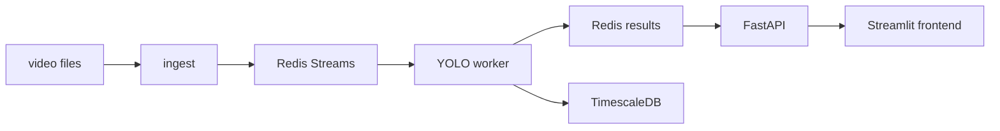
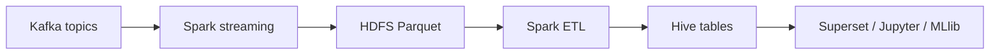

 # Ice Monitor
Видео-конвейер для двух камер с онлайн-сегментацией льда, записью результатов в TimescaleDB, batch-слоем в HDFS/Hive и BI-аналитикой в Superset.

## Что умеет проект
- В реальном времени читает видео с двух камер.
- Прогоняет кадры через YOLOv11s-seg.
- Показывает live-дэшборд в Streamlit.
- Пишет результаты модели и технические замеры в TimescaleDB.
- Копирует сырые события в Kafka и HDFS, затем собирает их в Hive.
- Поднимает готовые дашборды в Superset без ручной настройки.
- Запускает MLlib-эксперимент по качеству модели на разных долях данных.

## Классы сегментации
Модель использует 6 классов:

| id | class |
|---:|---|
| 0 | slush_ice |
| 1 | open_water |
| 2 | broken_ice |
| 3 | vessel |
| 4 | ice_field |
| 5 | background |

`vessel` - это статичная область судна. Она вырезается из рабочей зоны и не участвует в ледовых KPI.

## Что приходит из инференса
Инференс пишет в `ice_metrics`:

- `ts`
- `cam_id`
- `ice_conc`
- `ice_severity`
- `vessel_present`
- `pixels_json`

`pixels_json` хранит счётчики по классам:

- `ice_field`
- `broken_ice`
- `slush_ice`
- `vessel`
- `open_water`
- `background`

## Как считаются фронтовые метрики
Streamlit не показывает сырые проценты модели. Он считает показатели по рабочей области кадра:

```text
usable_pixels = total_pixels - vessel_pixels
ice_core = ice_field + broken_ice + slush_ice

ice_cover = ice_core / usable_pixels
field_cover = ice_field / usable_pixels
broken_cover = broken_ice / usable_pixels
slush_cover = slush_ice / usable_pixels

field_share = ice_field / ice_core
broken_share = broken_ice / ice_core
slush_share = slush_ice / ice_core
loose_share = (broken_ice + slush_ice) / ice_core

roughness = 0.7 * broken_share + 0.3 * slush_share
scene_pressure = clamp01(
    0.72 * field_cover +
    0.18 * ice_cover +
    0.10 * roughness
)

display_load = clamp01(
    (0.72 * field_cover + 0.18 * scene_pressure + 0.10 * trend_avg) *
    (0.9 + 0.1 * freshness)
)
```

Где:

- `trend_avg` - EMA последних значений `field_cover`.
- `freshness = 0.5^(age_sec / 8)` - штраф за устаревший результат.

Практический смысл:
- `field_cover` - главный индикатор сплошного ледового поля.
- `ice_cover` - сколько льда вообще видно в кадре.
- `loose_share` - доля рыхлого льда внутри ледового ядра.
- `scene_pressure` - компактный индекс тяжести сцены.
- `display_load` - сглаженная оценка для карточек на главном экране.

## Что показывает фронт
На главном экране Streamlit:

- `Сплошное поле`
- `Лёд в кадре`
- `Рыхлый лёд`
- `Плотность поля`

Верхняя сводка выбирает худшую камеру по нагрузке и показывает короткий вывод по сцене.

## Архитектура

**Hot path**


**Cold path**


## Superset
Superset при старте сам поднимает два светлых дашборда:

- `Модель и хранилище` - технический экран для отработки модели, накопления данных в TimescaleDB, лагов и состояния сервисов.
- `Ледовая аналитика` - полный аналитический экран по льду: покрытие, сплошное поле, рыхлый лёд, шуга и открытая вода.

Ручная настройка чарта не нужна.

## Сервисы и порты

| Сервис | Порт | Назначение |
|---|---:|---|
| Streamlit | 8501 | Live UI |
| FastAPI | 8000 | REST + WebSocket |
| Jupyter | 8888 | ноутбуки, token `ice` |
| Spark Master UI | 8080 | мониторинг Spark |
| YARN ResourceManager | 8088 | мониторинг YARN |
| HDFS Namenode | 9870 | HDFS web UI |
| Hive Server | 10000 | HiveQL JDBC |
| Kafka | 29092 | доступ с хоста |
| TimescaleDB | 5432 | Postgres |
| Superset | 8089 | BI-дашборды на TimescaleDB |

## Как запустить

### Подготовка данных

```bash
# Видео от двух камер
cp /path/to/bow.mp4    data/cam_a.mp4
cp /path/to/stern.mp4  data/cam_b.mp4

# Веса модели
cp /path/to/cam_a.pt   inference/weights/cam_a.pt
cp /path/to/cam_b.pt   inference/weights/cam_b.pt
```

### Запуск

```bash
make up
# или
docker compose up -d --build
```

Первый запуск дольше обычного, потому что подтягиваются образы Hadoop, Spark и Hive.

### Проверка

- Streamlit: http://localhost:8501
- API: http://localhost:8000/docs
- Superset: http://localhost:8089
- Spark Master: http://localhost:8080
- HDFS: http://localhost:9870
- Jupyter: http://localhost:8888

